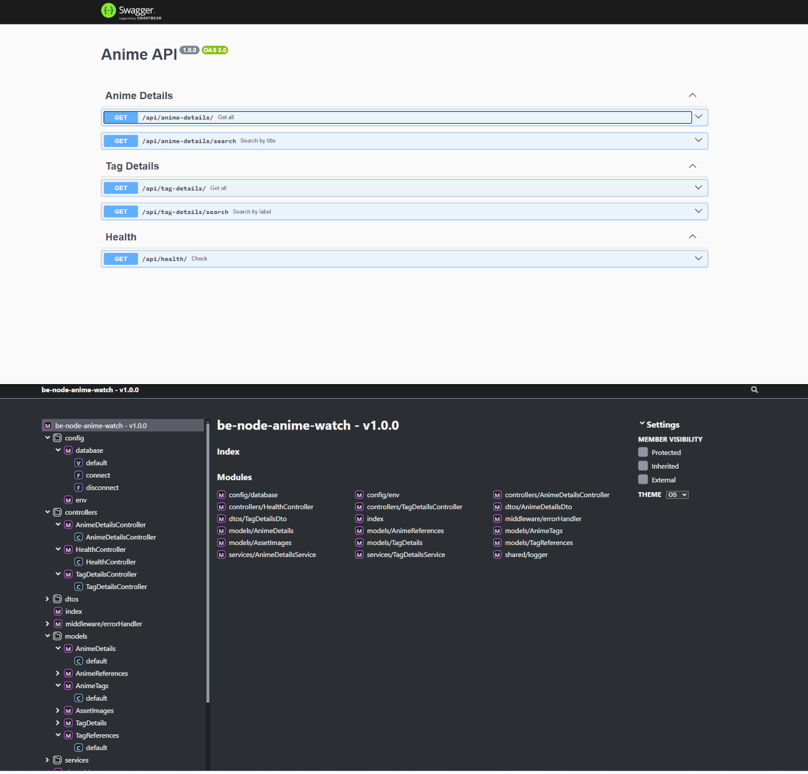

# **be-node-anime-watch**

<p align="center">
  
</p>


> **Version**: `1.0.0`

A simple API for managing anime details, tags, and assets, built with Node.js and TypeScript. It is designed to be lightweight, fast, and easy to use for developers seeking to integrate anime-related data into their projects.

 <!-- Placeholder: Replace with actual image -->

## **Features**

✅ RESTful API for:

- Retrieving anime details.
- Searching anime by title or tags.
- Paginated results for scalable data access.
  ✅ Powered by **routing-controllers** for clean architecture.  
  ✅ Built-in data validation with **class-validator**.  
  ✅ SQLite database management with **Sequelize**.  
  ✅ Structured logging using **Winston**.  
  ✅ OpenAPI documentation using **routing-controllers-openapi** and Swagger.  
  ✅ Robust environment configuration via `.env`.

## **Installation**

### Prerequisites

Make sure you have the following installed:

- **Node.js**: `>= 20.18.0`
- **Yarn**: `>= 4.5.1`

### Installation Steps

1. **Clone the repository**:
   
   ```bash
   git clone https://github.com/5h1ngy/anime-watch-api.git
   cd anime-watch-api
   ```

2. **Install dependencies**:
   
   ```bash
   yarn install
   ```

3. **Configure environment variables**:
   Create a `.env` file in the root directory:
   
   ```env
   NODE_ENV=development
   SERVER_PORT=3000
   STORAGE_FILE=db_dump.db
   LOGGING_DB=true
   LOG_DEFAULT_LEVEL=info
   ```

## **Usage**

### Development Mode

Start the API in development mode:

```bash
yarn dev
```

### Production Mode

Build and start the API in production mode:

```bash
yarn build
yarn start
```

### API Documentation

Visit the Swagger documentation at:

```
http://localhost:3000/docs
```

By default, the API will:

- Serve anime-related data from the SQLite database.
- Expose endpoints for anime details and tags.

## **Endpoints**

### Base URL

```
http://localhost:3000/api
```

### Example Endpoints

- **GET `/anime-details`**  
  Fetch paginated anime details.

- **GET `/anime-details/search?title=Naruto`**  
  Search anime by title.

- **GET `/tag-details/search?label=Action`**  
  Search anime tags by label.

Refer to the [Swagger documentation](http://localhost:3000/docs) for the complete API reference.

## **Project Structure**

```
src/
├── config/         # Environment and database configuration
├── controllers/    # REST API controllers
├── dtos/           # Data Transfer Objects for validation
├── middleware/     # Custom middleware for error handling and logging
├── models/         # Sequelize models for database entities
├── services/       # Business logic and database interactions
├── shared/         # Shared utilities like logging
├── index.ts        # Main entry point
```

## **Logging**

Logging is managed with [Winston](https://github.com/winstonjs/winston). All logs are stored in the `logs/` directory with daily rotation.

### Log Levels

- **Error**: For critical issues.
- **Warn**: For non-critical warnings.
- **Info**: General informational messages.
- **Verbose**: Detailed logs for debugging.

Example Log:

```
[2024-11-21 14:30:00] info: Server running on http://localhost:3000
[2024-11-21 14:30:10] verbose: Executing SQL: SELECT * FROM anime_details LIMIT 10;
```

## **Documentation**

Generate TypeScript documentation with **Typedoc**:

```bash
yarn docs
```

The documentation will be saved in the `docs/` directory.

## **Database**

- **Database**: SQLite
- **Database File**: Configurable via the `STORAGE_FILE` environment variable.
- **Sequelize**: Used for ORM and migrations.

## **License and Data Attribution**

### License for the Code

This project is licensed under the MIT License. See the [LICENSE](LICENSE) file for full details.

### Data Attribution for AniDB

This project uses data from AniDB (https://anidb.net), which is licensed under the **Creative Commons Attribution-NonCommercial-ShareAlike 4.0 International License**.

#### Key Points:

- You **may not** use the data for **commercial purposes**.
- Any derivative works created using AniDB data **must** also be distributed under the same license.

For full details, visit the official license page: [https://creativecommons.org/licenses/by-nc-sa/4.0/](https://creativecommons.org/licenses/by-nc-sa/4.0/).

AniDB is the original source of the data. For more information, visit [https://anidb.net](https://anidb.net).

## **Author**

Project created by 5h1ngy.

## **License**

This project is distributed under the MIT license. See the [LICENSE](LICENSE) file for more details.